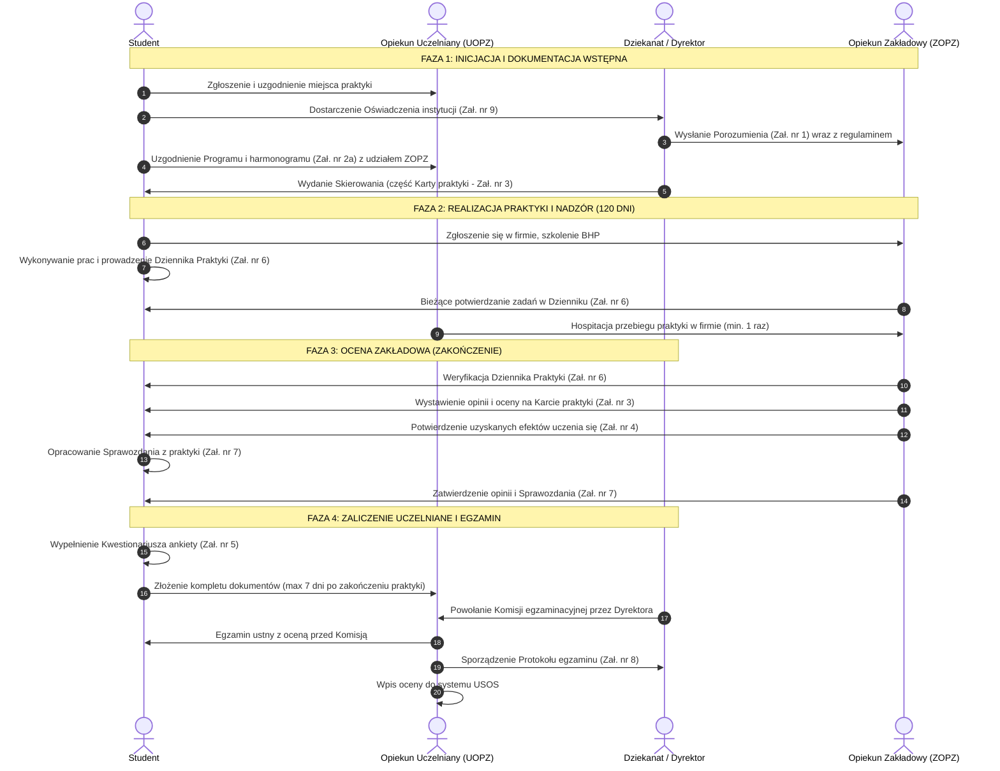
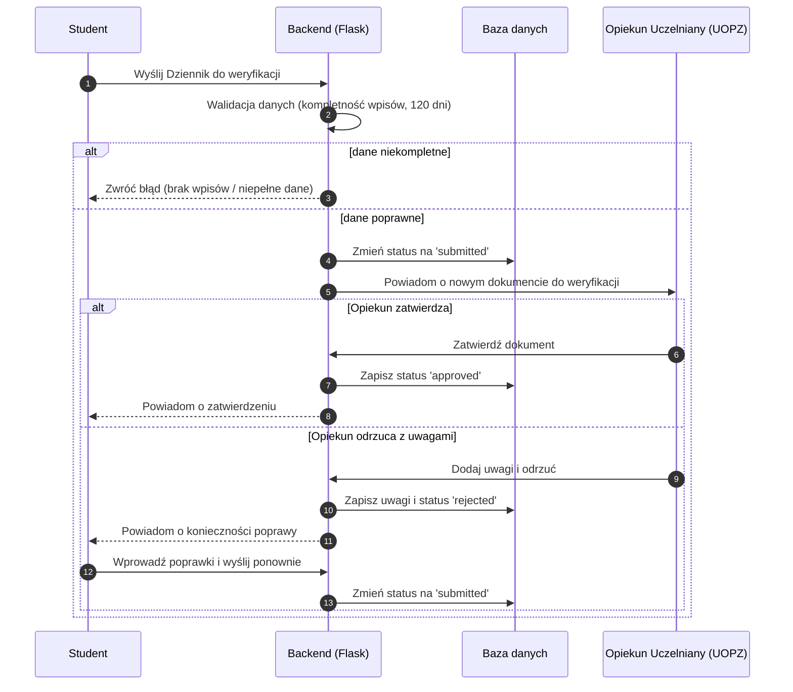
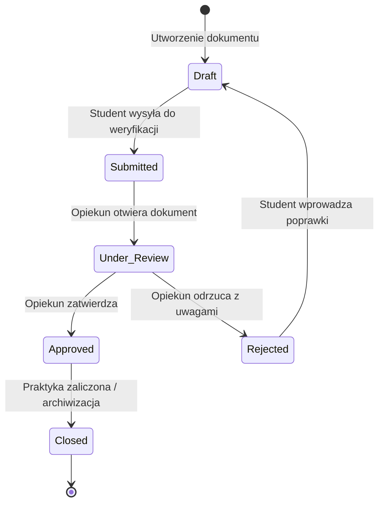
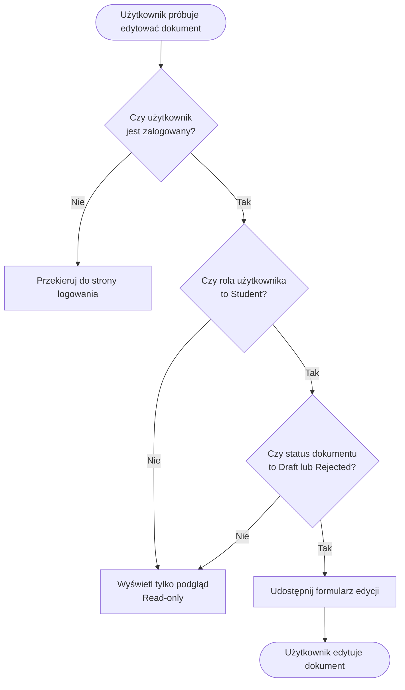
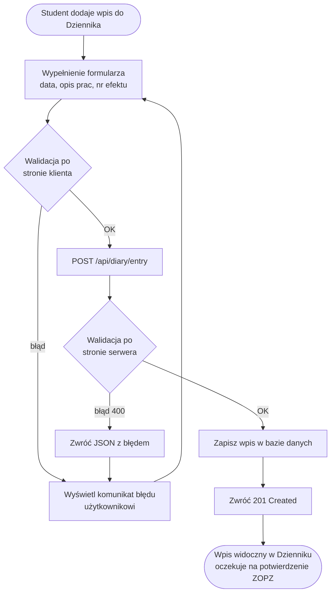
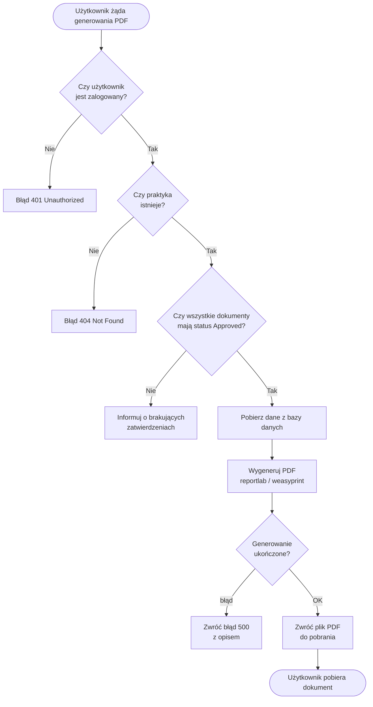

# Diagramy Mermaid — System Obsługi Praktyk Zawodowych

---

## Diagram 1: Sekwencja — Obieg dokumentacji praktyki (proces biznesowy)

---

## Diagram 2: Sekwencja — Weryfikacja Dziennika Praktyk (przepływ techniczny)

---

## Diagram 3: Stany dokumentu — Cykl życia dokumentu praktyki

---

## Diagram 4: Flowchart — Logika uprawnień edycji dokumentu

---

## Diagram 5: Flowchart — Przepływ danych przy zapisie wpisu w Dzienniku

---

## Diagram 6: Flowchart — Logika biznesowa generowania PDF

